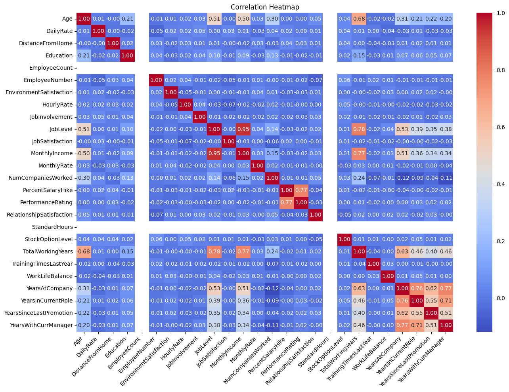
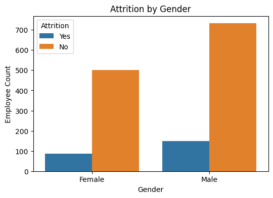
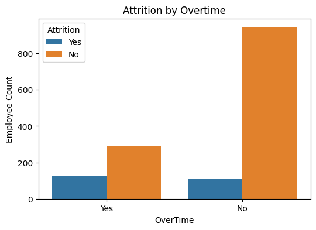
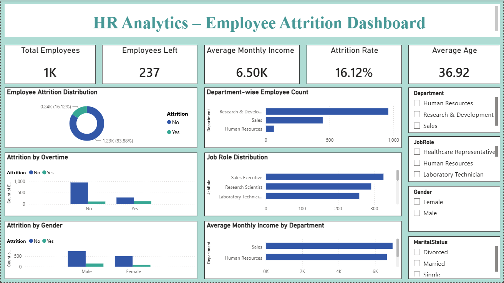

# HR Analytics Project

## Table of Contents

- [Project Overview](#project-overview)
- [Business Problem](#business-problem)
- [Dataset Information](#dataset-information)
- [Tools & Technologies](#tools--technologies)
- [Data Validation](#data-validation)
- [Exploratory Data Analysis (Excel)](#exploratory-data-analysis-excel)
- [SQL Business Analysis](#sql-business-analysis)
- [Python Analysis](#python-analysis)
- [Python Visualizations](#python-visualizations)
- [Power BI Dashboard](#power-bi-dashboard)
- [Dashboard Preview](#dashboard-preview)
- [Key Insights](#key-insights)
- [Business Recommendations](#business-recommendations)
- [Future Improvements](#future-improvements)
- [Project Structure](#project-structure)
- [Skills Demonstrated](#skills-demonstrated)
- [Author](#author)

---

## Project Overview

HR Analytics helps organizations understand workforce trends, identify employee attrition patterns, and support data-driven HR decision-making.

This project analyzes employee data using Excel, SQL, Python, and Power BI to uncover key workforce insights and provide actionable recommendations for improving employee retention.

This project demonstrates an end-to-end data analytics workflow, including:

- Data validation using Excel
- Business analysis using SQL
- Exploratory Data Analysis (EDA) using Python
- Interactive dashboard development using Power BI

---

## Business Problem

Employee attrition affects productivity, increases recruitment costs, and impacts overall organizational performance.

The objectives of this project are:

- Analyze employee attrition trends
- Identify departments with high attrition
- Study the impact of overtime, gender, job role, and job satisfaction
- Understand workforce patterns
- Generate business insights for improving employee retention

---

## Dataset Information

The dataset contains **1,470 employee records** and **35 features** related to employee demographics, job roles, compensation, performance, and attrition.

The dataset includes information such as:

- Employee Demographics
- Department
- Job Role
- Monthly Income
- Overtime
- Job Satisfaction
- Work-Life Balance
- Years at Company
- Attrition Status

---

## Tools & Technologies

- Microsoft Excel
- SQL
- Python
- Power BI

---

## Data Validation

The dataset was validated before analysis.

Validation steps performed:

- Checked dataset structure
- Verified data types
- Confirmed there were no missing values
- Confirmed there were no duplicate records
- Prepared the dataset for analysis

---

## Exploratory Data Analysis (Excel)

Microsoft Excel was used to perform initial data exploration using Pivot Tables and Pivot Charts.

Key analysis performed:

- Attrition Analysis
- Department Analysis
- Gender Analysis
- Overtime Analysis
- Job Role Analysis
- Key Business Insights

Excel features used:

- Pivot Tables
- Pivot Charts
- Conditional Formatting

---

## SQL Business Analysis

SQL queries were written to answer key HR business questions.

Business analysis included:

- Total Employees
- Employee Attrition
- Department-wise Attrition
- Gender-wise Attrition
- Overtime Analysis
- Job Role Analysis
- Average Monthly Income
- Job Satisfaction Analysis

---

## Python Analysis

Exploratory Data Analysis (EDA) was performed using Python to identify employee attrition trends and workforce patterns.

Key analysis performed:

- Dataset Exploration
- Descriptive Statistics
- Employee Attrition Analysis
- Department-wise Analysis
- Gender Analysis
- Job Role Analysis
- Monthly Income Analysis
- Correlation Analysis
- Business Insights

## Python Visualizations

Below are some of the visualizations created during the Exploratory Data Analysis (EDA) using Python.

### Correlation Analysis



---

### Attrition by Gender



---

### Attrition by Overtime



---

## Power BI Dashboard

An interactive Power BI dashboard was developed to visualize employee attrition trends and workforce insights.

Dashboard features include:

- Total Employees
- Employees Left
- Average Monthly Income
- Attrition Rate
- Average Age
- Employee Attrition Distribution
- Department-wise Employee Count
- Attrition by Overtime
- Job Role Distribution
- Attrition by Gender
- Average Monthly Income by Department

Interactive Filters:

- Department
- Job Role
- Gender
- Marital Status

---

## Dashboard Preview

Below is the Power BI dashboard created for HR Analytics.



---

## Key Insights

The analysis revealed important insights:

- Research & Development has the highest employee count.
- Employees working overtime have higher attrition.
- Job satisfaction significantly impacts employee retention.
- Monthly income varies across departments and job roles.
- Multiple HR factors influence employee attrition.

---

## Business Recommendations

Based on the analysis:

- Improve work-life balance.
- Reduce excessive overtime.
- Increase employee engagement.
- Provide career growth opportunities.
- Monitor employee satisfaction regularly.

---

## Future Improvements

This project can be extended with:

- Add advanced HR KPIs
- Integrate real-time HR data
- Automate dashboard refresh
- Enhance dashboard interactivity

---

## Project Structure

```text
HR_Analytics_Project
│
├── Dataset
│   └── HR_Analytics.csv
│
├── Excel_Analysis
│   └── HR_Analytics.xlsx
│
├── SQL_Analysis
│   └── HR_Analytics_SQL.sql
│
├── Python_EDA
│   └── HR_Analytics_EDA.ipynb
│
├── Power_BI
│   └── HR_Analytics_Dashboard.pbix
│
├── Images
│   ├── Dashboard.png
│   ├── Correlation_Analysis.png
│   ├── Attrition_by_Gender.png
│   └── Attrition_by_Overtime.png
│
└── README.md
```

---

## Skills Demonstrated

- Data Validation
- Data Cleaning
- Exploratory Data Analysis (EDA)
- SQL Query Writing
- Data Visualization
- Dashboard Development
- Business Analysis
- Microsoft Excel
- Python
- Power BI

---

## Author

**Shaik Rahima**

Data Analytics Enthusiast

GitHub: https://github.com/shaikrahima20
